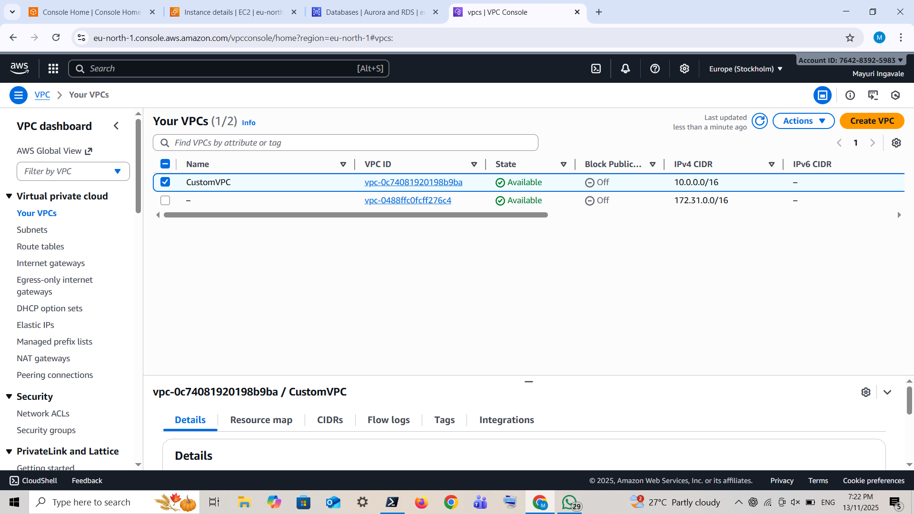
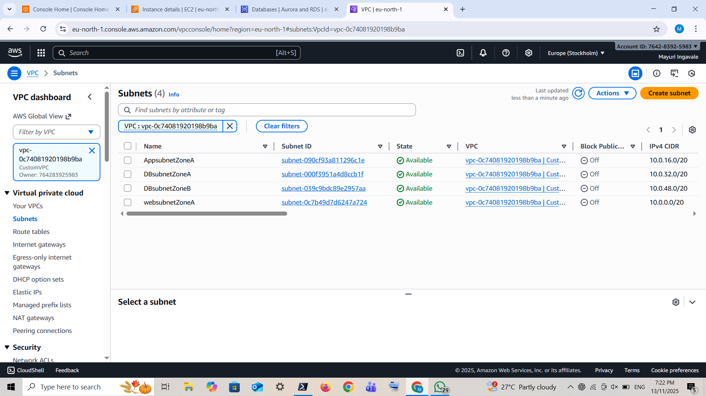
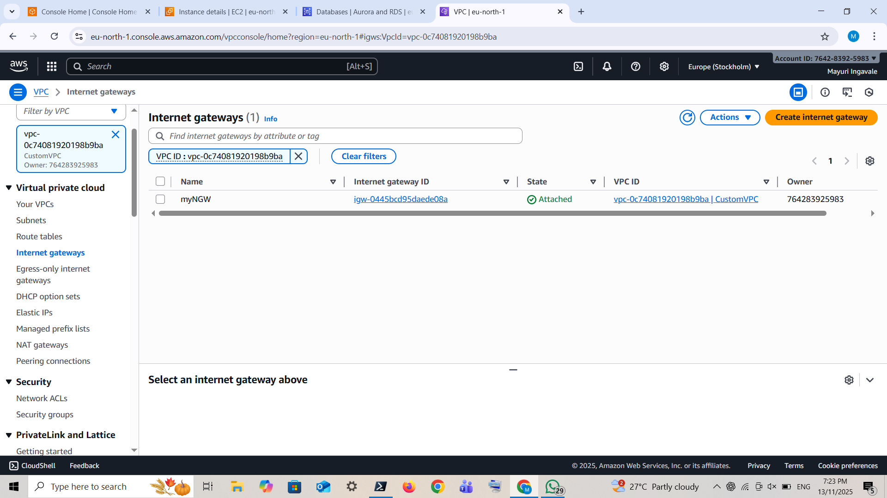
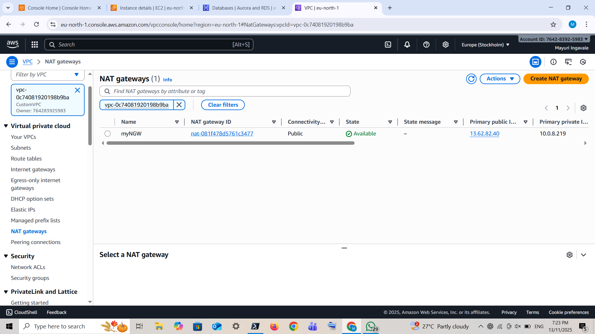
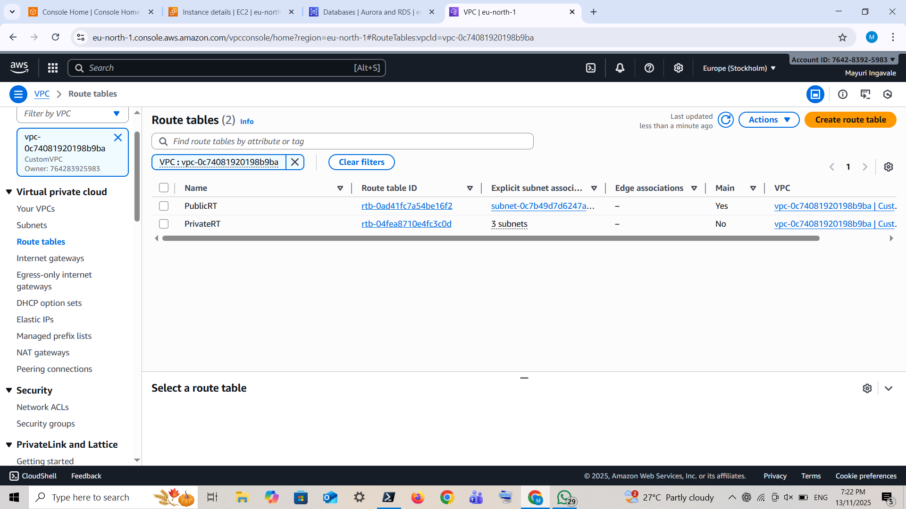
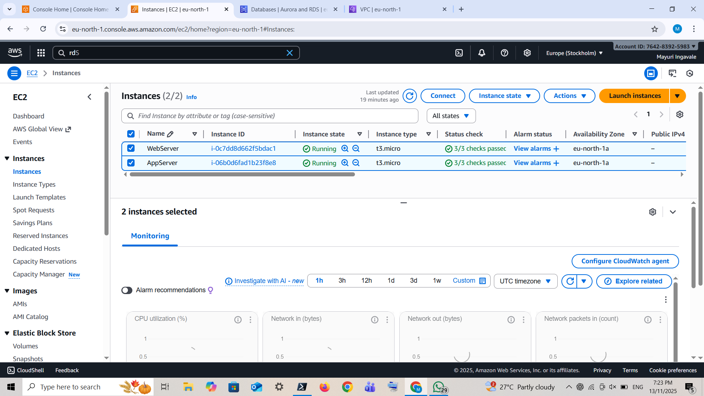
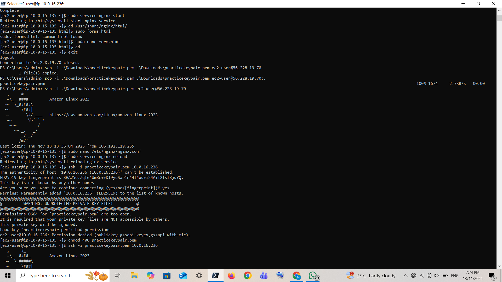

# Building a 3-Tier Web Application with AWS RDS as the Database Layer

## Project Overview
This project demonstrates a *3-tier architecture* using AWS services, separating the application into *Web, Application, and Database tiers*.  
It is designed for *scalability, security, and high availability*.

- *Web Tier:* Hosts the front-end interface using EC2 instances in a public subnet.  
- *Application Tier:* Processes business logic in EC2 instances located in private subnets.  
- *Database Tier:* Stores persistent data using RDS in private subnets with Multi-AZ deployment.  

---

## Architecture Components

| Tier | AWS Services | Description |
|------|-------------|------------|
| Web | EC2, Security Groups, Public Subnet, IGW | Handles user requests and serves web content |
| Application | EC2, Private Subnet, NAT Gateway | Processes business logic, communicates with DB |
| Database | RDS, Private Subnets,  | Stores data securely with high availability |
| Networking | VPC, Subnets, Route Tables, IGW, NAT Gateway | Provides isolated network with controlled access |

---
## Deployment Steps

### Step 1 :- Create Custom VPC
CIDR-block 10.0.0.0/16

---

### Step 2 :- Create subnets for Web, App, and DB 
 Create two subnets for DB one in Availability Zone A & Availability Zone B (for RDS DB subnet group)

---

### Step 3 :- Create a Internet Gateway

Select CustomVpc

---

### Step 4 :- Create NATGateway

---
### Step 5 :- Create Route table
1.Public Route Table :-
By default, AWS automatically creates a route table for the VPC (public route).  
   - Attach it to the *public subnet*.
   - Configure route to Internet Gateway (IGW)

2.Private Route Table :- Manually create a new route table for private subnets.  
   - Add a route to the *NAT Gateway* for internet access.  
   - Attach this private route table to all *private subnets* (App & DB).

   

   ---

   ### Step 6 :- Create a RDS
   - Choose a database creation method(Choose Standard create.)
   - Select Engine(MySQL)
   - Pick a Template (Free tier)
   - Set DB instance name, username, password
   - Configure VPC, public access, and security group.

   

   ---

   ### Step 7:- Add in sercurity group of RDS
   - Ad MYSQL/Aurora

   

   ---
   ### Step 8:- Launch instance
   - Web Server- With CustomVpc,websubnet,auto-assign=enable
   - App server- With CustomVc,appsubnet,auto-assign=disable
   - In Both Server add Security Group Port 80

   

   ---
   ### Step 9:- SSH to powershell
   - Copy the Public IP of Web Server
   - SSH to powershell
   - Also install a nginx
   - Install a mariadb105-server

---
### Step 10:- Create WebPage
- Start Services
- Create form.html Page
- Download a keypair in your laptop
- In nginx Configuration file add proxy path
- Give permission 400 to keypair

---
### Step 11:- SSH to AppServer
- Copy the Appserver Private IP

---
### Step 12:- In AppServer
- Install php,nginx and also start it
- Create a submit.php page
- Install compresor file

---
### Step 13:- Login to mysql database
- Used RDS Endpoint
- Create a database
- Create a Table
- Restart all services

---
### Step 14:- Check on Browser
- Copy WebSever PublicIP
- Paste on browser

---
### Step 15:- Check data stored in database

---

## Conclusion
Setting up AWS RDS made database management easier and more efficient. With automated backups, scalability, and strong security, it allows developers to focus on building applications instead of handling infrastructure. A simple step toward smarter cloud management!

---

